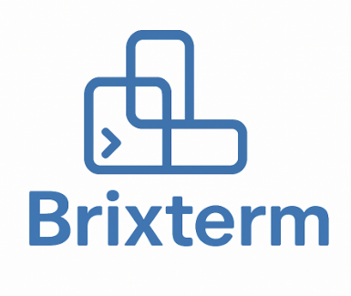

## About

**BrixTerm** is a simple terminal app that integrates GPT to assist with everyday development tasks.
> Implemented using **LLMBrix** framework: https://github.com/matejkvassay/LLMBrix

---

## Features

- Automatically suggests fixes for failed Unix commands
- Generates Python code and copies it directly to your clipboard
- Built-in chatbot accessible inside the terminal

> **Note:** This tool is **not fully agentic** — developers maintain control by using pre-defined commands.

---

## Available Commands

### 1. TERMINAL (default)

Type any terminal command.
If it fails, the AI will suggest a corrected version.

---

### 2. INTERACTIVE SHELL

Use `!<command>` to run an interactive shell command.
Without the `!`, interactive commands timeout after 10 seconds.
**Example:** `!htop`

---

### 3. CODE GEN

Use `c <your request>` to generate Python code.
The generated code is automatically copied to your clipboard.

---

### 4. CODE GEN + CLIPBOARD

Use `ccc <your request>` to generate Python code.
The content of your clipboard is automatically passed to the code generator prompt.
The generated code is copied back to your clipboard.

---

### 5. CHAT ANSWER

Use `a <your request>` to chat with GPT.

---

### 6. CHAT ANSWER + CLIPBOARD

Use `aaa <your request>` to chat with GPT.
The content of your clipboard is automatically passed to the AI chatbot prompt.

---

### 7. EXIT

Use `q` to exit the application.

## Usage guide

### Install

```bash
pip install brix-term
```

### Configure Gemini API key

```bash
# Configure Gemini API access
export GOOGLE_API_KEY='<TOKEN>'
```

### Run

```bash
brixterm
```
